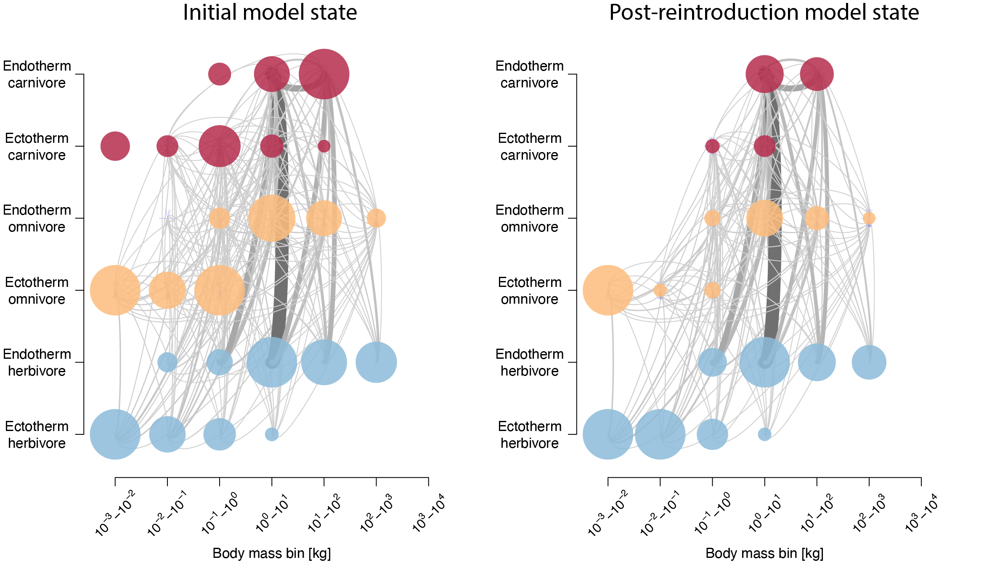
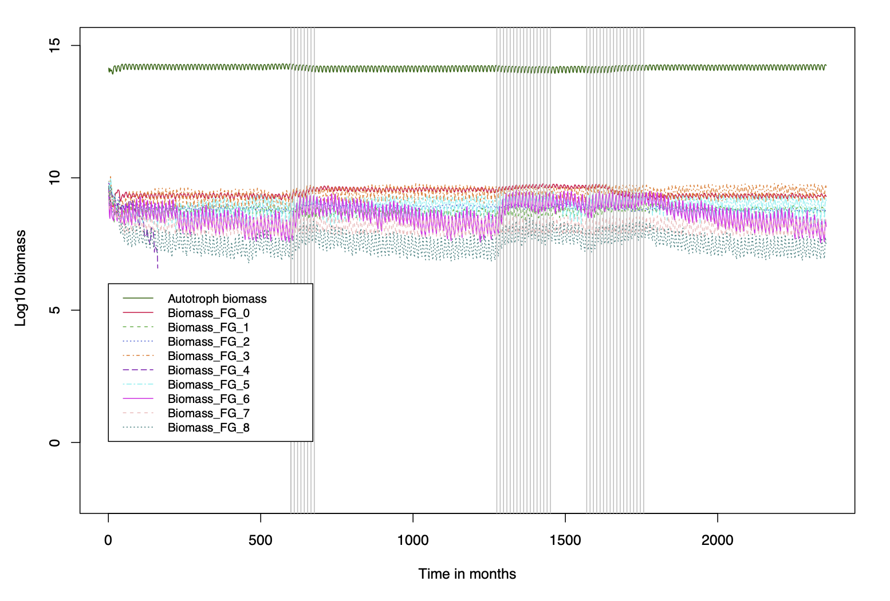

# MadingleyR Rewilding

MadingleyR version modified to run simulations for the Rewilding Europe project. Two modifications were implemented to the original code in order to improve the realism of the simulations:

-   The competition for resources between herbivore body mass categories was partially lifted by binning herbivores using body mass (into 8 bins) and allowing each bin to feed on independent vegetation stocks.

-   Small-bodied prey (\<150g) were made invisible to predators once the summed cohort density of all cohorts with similar traits dropped below a set threshold (to protect them for going extinct).

The published MadingleyR version can be found [here](https://madingleyr.github.io/MadingleyR/). Modifications were made to MadingleyR version v1.0.0 and source code version v2.00 published on the 11th of February 2022.

## Installation

Installing the package into your R library can be done using the following code. Please note, that the source code is only compiled for Linux. Instructions for how to compile the code for Windows and Mac can be found [here](https://madingleyr.github.io/MadingleyR/SourceCode/CompileMac.html) and [here](https://madingleyr.github.io/MadingleyR/SourceCode/CompileWindows.html).

``` r
# Download the zip from this repository
# link: https://anonymous.4open.science/api/repo/RewildMadingleyR-FCC9/file/Rewild-MadingleyR.zip

# Install package from the local zip using devtools
devtools::install_local("MadingleyRewilding-main.zip")
```

## Usage

Usage of this version of the package is identical to the published MadingleyR package with the exception of three input arguments:

- ```threshold_prey_body_mass_kg``` controls the body mass below which the hetetrophic cohorts can become invisible once their density drops below the threshold set by "threshold_prey_density_per_hectare.

- ```threshold_prey_density_per_hectare``` defines the minimum density threshold (in individuals/km^2^) below which the small-bodied heterotrophs (with a body mass \< ```threshold_prey_body_mass_kg```) will become invisible.

- ```n_autotroph_bins``` a numeric value defining number of body mass bins to divide the herbivores and omnivores by. This value automatically also splits up the autotrophic stocks into 5 proportions. If for example ```n_autotroph_bins = 5```, cohorts identified as herbivores and omnivores will be divided over 5 groups, they will be assigned to a specific group depending on their adult body mass. If the body mass range is e.g. from 1 gram to 10.000 kg, equal bins will be created, in this case the range stretches over 7 orders of magnitudes (10^-3 kg to 10^4 kg), the resulting bin borders will be: 10^-3, 10^-1, 10^1,  10^3,  10^5,  10^7, this means that bin borders will be separated by 2 orders of magnitudes. Cohorts with a body mass between 10^5 and 10^7 kg will eat from a different proportion of the vegetation then cohorts between 10^-1 and 10^1 kg. Competition will be lowered between these two example body mass groups.

Please note that the names of some of the function have changed compared to the published MadingleyR package by Hoeks et al. This is done to avoid a mixup between the use of both packages. 

## Example case study code

The code below is an example for the main reintroduction scenario discussed in the paper. It can also be found in a R script here on this repository. It produces results for the high productivity low seasonality location. This code below creates the following plots:

<br>

<p align="center">
 <br><br><em>Model food-web comparing the initial state to the post-reintroduction state.</em> <br> <br> <br>
</p>

<p align="center">
 <br> <em>Complete simulation time line. Grey vertical lines show when modifications to the model objects were performed.</em> <br> <br> <br>
</p>


#### Load the packages needed

First we need to install the Rewild-MadingleyR package and import all other required packages
``` r
# install package
#devtools::install_local("Rewild-MadingleyR.zip")

# import packages
library(MadingleyRewilding) # load to run the altered version of the package
library(MadingleyR) # load to make plots at the end of simulation
library(raster) # for spatial inputs
library(dplyr) # for data manipulation
library(mFD) # for Jaccard index calculations
```
#### Load inputs and define parameters 

Here we load all the necessary data and define the inputs. All date used is available directly from here, no external sources are required. The 0.5 degree spatial layers will be downloaded using the ```DownloadLoadHalfDegreeInputs()``` function.
``` r
# Please reset the baseDIR path to a folder of your choice
baseDir <- "/path/to/outputs/"
envDIR <- paste0(baseDir,'/env/')
outDIR <- paste0(baseDir,'/out_','_',format(Sys.time(), "%Y_%m_%d_%H_%M"),'/')
outDIRtemp <- paste0(baseDir,'/tempdir_',sample(1000000:8000000,1),'/')
dir.create(envDIR)
dir.create(outDIR)
dir.create(outDIRtemp)

# Simulation settings
coords_LL <- cbind(-5, 40) # Low NPP, Low seasonilty
coords_HL <- cbind(4, 45) # High NPP, Low seasonilty
coords_LH <- cbind(16, 69) # Low NPP, High seasonilty
coords_HH <- cbind(32, 60) # High NPP, High seasonilty
select_location <- coords_HL # select the desired location here
spatial_window <- c(select_location[1],select_location[1]+3,select_location[2],select_location[2]+3) # Set spatial window
Years_SpinUp <- 50 #1000 #SpinUp
Years_PostRemoval <- 50 #500 #Stabilisation post removal 1
Years_PostReintroduction1 <- 10 #50 #Stabilisation post reintroduction 1 (herbivores and omnivores)
Years_PostReintroduction2 <- 50 #500 #Stabilisation post reintroduction 2 (carnivores)
BMafterRemoval_H <- 200*1000 # max mass herbivores after removal (g) (Bison)
BMafterRemoval_O <- 100*1000 # max mass omnivores after removal (g) (Bear)
BMafterRemoval_C <- 10*1000  # max mass carnivores after removal (g) (Wolf)
mxch <- 500 #700 #max cohort number
SampRemoved <- 2 # cohorts to remove per functional group per grid cell per year 
nAnimalsToReintroduce <- 10 #n animals to introduce per functional group
outbins <- c(0.001, 0.01, 0.1, 1, 10, 20, 100, 200, 1000) # bins in KG, outputs for plotting
MnPreyDens <- 0.01#min density of small species (0.01 corresponds to 1/km2, which is extremely low density for small endotherms)
MinPreyDensThresh <- 0.15 # 0.15 #body mass threshold below which MinPreyDensityPerHect applies (150 g seems sensible)

# Downloads and imports the 0.5 degree inputs from a zip into the selected dir
# Skips download if files already exist in selected dir
# After downloading, rasters get cropped to spatial window 
# This helps to increase loading times of the spatial rasters during the model runs
sp_inputs <- DownloadLoadHalfDegreeInputs(envDIR)
sp_inputs <- CropSpatialRastersToWindow(sp_inputs,spatial_window) 
#SetSingleValueForAllRasters(select_location)

# Get Rewilding Europe specific cohort definitions
chrt_def <- GetRewildingEuropeCohortDefs()

# Get other default (non-spatial) model params
stck_def <- MadingleyInputs('stock definition')
mdl_prms <- MadingleyInputs('model parameters')

# Create list that holds all the Madingley output data
mdata <- list()
```

#### Initialize the model and run spin-up simulation

Here we initialize the model using the ```MadingleyInit``` function, we set the ```n_autotroph_bins = 4```. After the initialized files are returned we run the model spin-up using the ```MadingleyRun``` function. Files will be exported only during the last 5 simulation years.
```R
# Initialize the Madingley model
init <- MadingleyInit( 
  cohort_def=chrt_def, 
  stock_def=stck_def, 
  spatial_inputs=sp_inputs, 
  spatial_window=spatial_window, 
  max_cohort = mxch,
  n_autotroph_bins = 4)

# Run spin-up model
years <- Years_SpinUp
export <- years - 5
mdata$spinup <- MadingleyRun( 
  madingley_data = init,
  cohort_def=chrt_def, 
  stock_def=stck_def, 
  spatial_inputs=sp_inputs, 
  threshold_prey_density_per_hectare=MnPreyDens, 
  threshold_prey_body_mass_kg=MinPreyDensThresh, 
  out_dir = outDIR, 
  years = years, 
  max_cohort = mxch, 
  output_timestep = c(0,export,export,export),
  model_parameters = mdl_prms,
  silenced=FALSE, parallel = TRUE,
  cohort_output_bins = outbins,
  n_autotroph_bins = 4
) 
```
#### Large-body mammal removal

The code below gradually removes the large-body mammals from the previous simulation state. It uses the previously defined thresholds: 

| Variable set           | value used in grams   |  Example animal |
|:-----------------------|:----------------------|:----------------|
| ```BMafterRemoval_H``` | ```200*1000```        | Bison           |
| ```BMafterRemoval_O``` | ```100*1000 ```       | Bear            |
| ```BMafterRemoval_C``` | ```10*1000 ```        | Wolf            | 


```r
# Stop cohorts from "evolving" (changing their body mass between generations) 
# Settings this to 1 fixes their body mass, this helps in the removal process
# The juvenile body mass is always identical to the parent cohort
mdl_prms[51,2] <- 1

# Create data needed for removal phase
mdata_tmp <- mdata$spinup

# Set max body mass
sp_inputs$Endo_H_max[] <- BMafterRemoval_H
sp_inputs$Endo_C_max[] <- BMafterRemoval_C
sp_inputs$Endo_O_max[] <- BMafterRemoval_O

# Get cohorts to remove, used for the reintroduction later
Cohorts_to_remove <- mdata_tmp$cohorts %>% 
  filter(FunctionalGroupIndex == 0 & AdultMass>BMafterRemoval_H | 
         FunctionalGroupIndex == 1 & AdultMass>BMafterRemoval_C | 
         FunctionalGroupIndex == 2 & AdultMass>BMafterRemoval_O )

# This repeat goes on until all cohorts above a max body mass are gone
# It removes one random cohort above the threshold per endothermic functional group per year
tracker <- 0
mdata$spinup <- mdata_tmp # reset spinup
repeat {
  
  TotalRemaining <- 0
  tracker <- tracker+1
  print(paste('Year', tracker))
  
  # loop over model grid cells
  for(j in 1:length(unique(mdata_tmp$cohorts$GridcellIndex))){
    
    # Get cell index
    cell <- unique(mdata_tmp$cohorts$GridcellIndex)[j]
    
    #for each endothermic functional group
    for (d in 0:2) { 
      
      # functional group index to feeding guild category
      guild <- switch(as.character(d),"0"="H","1"="C","2"="O")
      
      # Get unique body masses of cohorts to remove
      BM_toRemove <- mdata[[tracker]]$cohorts %>% 
        filter(GridcellIndex==cell & FunctionalGroupIndex==d) %>% 
        filter(AdultMass>get(paste0('BMafterRemoval_',guild))) %>% 
        arrange(desc(AdultMass)) %>% 
        pull(AdultMass) %>%
        unique() 
      
      # If nothing to remove, skip
      if(length(BM_toRemove)==0){
        assign(paste0('BM_toRemove_', d), c()); next
      } 
      
      # Remove the first X starting from the largest
      if(length(BM_toRemove)>SampRemoved) { 
        BM_toRemove2 <- BM_toRemove[1:SampRemoved]
      } else {
        BM_toRemove2 <- BM_toRemove
      } 

      ind_rem <- mdata[[tracker]]$cohorts %>% 
        with(which(AdultMass %in% BM_toRemove2 & GridcellIndex==cell & FunctionalGroupIndex==d))
      
      if(length(ind_rem)>0) {
        mdata[[tracker]]$cohorts <- mdata[[tracker]]$cohorts[-ind_rem,]
      }
  
      BM_toRemove <- BM_toRemove[!BM_toRemove %in% BM_toRemove2]
      
      assign(paste0('BM_toRemove_', d), BM_toRemove)
      
    }# Closes loop through endothermic functional groups
    
    TotalRemaining <- TotalRemaining + length(BM_toRemove_0) + length(BM_toRemove_1) + length(BM_toRemove_2)
    
    
  } # End loop through grid cell cells
  
  print(paste0('Large-bodied endothermic cohorts remaining: ', TotalRemaining))
  
  # If there's nothing else to remove, break the repeat
  if(TotalRemaining==0) {
    break
  } 
  
  # Empty outDIRtemp except for output needed for next simulation which is stored in mdata[[tracker]]
  system(paste0("cd ",outDIRtemp, " && ls | grep -v ",sub("/", "", sub("/", "", mdata[[tracker]]$out_dir_name))," | xargs rm -rf"))

  # Run the model with removed cohorts for 1 year
  mdata[[tracker+1]] <- MadingleyRun(
    cohort_def=chrt_def,
    stock_def=stck_def,
    spatial_inputs=sp_inputs, 
    threshold_prey_density_per_hectare=MnPreyDens, 
    threshold_prey_body_mass_kg=MinPreyDensThresh, 
    madingley_data = mdata[[tracker]],
    dispersal_off = TRUE,
    output_timestep = c(0, 999, 999, 999), 
    out_dir = outDIRtemp,
    years = 1,
    max_cohort = mxch,
    model_parameters = mdl_prms,
    silenced=TRUE,
    cohort_output_bins = outbins,
    parallel = TRUE,
    n_autotroph_bins = 4
  )
  
}

# Run another year and save the output
mdata[[length(mdata)+1]] <- MadingleyRun( 
  madingley_data = mdata[[length(mdata)]],
  cohort_def=chrt_def, 
  stock_def=stck_def,
  spatial_inputs=sp_inputs,
  threshold_prey_density_per_hectare=MnPreyDens, 
  threshold_prey_body_mass_kg=MinPreyDensThresh,  
  out_dir = outDIR, 
  years = 1,
  max_cohort = mxch, 
  model_parameters = mdl_prms, 
  cohort_output_bins = outbins,
  parallel = TRUE,
  n_autotroph_bins = 4
)
```

#### Stabilization phase

After the reintroduction we run a stabilization phase. 

```r
years <- Years_PostRemoval
export <- years - 5
mdata$post_removal <- MadingleyRun( 
  madingley_data = mdata[[length(mdata)]],
  cohort_def=chrt_def, stock_def=stck_def,
  spatial_inputs=sp_inputs, 
  threshold_prey_density_per_hectare=MnPreyDens, 
  threshold_prey_body_mass_kg=MinPreyDensThresh,   
  out_dir = outDIR, 
  years = years,
  max_cohort = mxch, 
  model_parameters = mdl_prms, 
  output_timestep = c(0,export,export,export),
  parallel = TRUE,
  cohort_output_bins = outbins,
  n_autotroph_bins = 4
)
```

#### Reintroduction phase 1: large-bodied herbivores and omnivores

For this reintroduction scenario we first reintroduce large-bodied herbivores and omnivores followed by a 50-year stabilization phase.

```r
# Get cohort properties to reintroduce
# This function reduces the number of cohorts to reintroduce
# It does so by aggregating by adult body mass, gridcell and functional group
Cohorts_to_reintroduce <- GetCohortsToReintroduce(Cohorts_to_remove)

# set the maximum allowed body masses 
#sp_inputs$Endo_H_max[] = chrt_def$PROPERTY_Maximum.mass[chrt_def$NOTES_group.description=="Bison"]
#sp_inputs$Endo_O_max[] = chrt_def$PROPERTY_Maximum.mass[chrt_def$NOTES_group.description=="Bear"]

# Split cohorts to reintroduce and sort by adult body mass
H_Cohorts_to_reintro <- Cohorts_to_reintroduce %>% 
  filter(FunctionalGroupIndex==0) %>% 
  arrange(GridcellIndex, AdultMass)
C_Cohorts_to_reintro <- Cohorts_to_reintroduce %>% 
  filter(FunctionalGroupIndex==1) %>% 
  arrange(GridcellIndex, AdultMass)
O_Cohorts_to_reintro <- Cohorts_to_reintroduce %>% 
  filter(FunctionalGroupIndex==2) %>% 
  arrange(GridcellIndex, AdultMass)


## Reintroduce herbivores+omnivores
tracker <- 0
repeat{
  
  # if all cohorts are inserted break
  if(nrow(H_Cohorts_to_reintro)  + nrow(O_Cohorts_to_reintro)  == 0) {break}
  
  # if there are still herbivores or omnivores to reintroduce
  if(nrow(H_Cohorts_to_reintro)  + nrow(O_Cohorts_to_reintro) > 0) {
    
    # update tracker
    tracker <- tracker + 1
    print(paste("year:",tracker))
    
    # get herbivore cohorts to insert
    if(nrow(H_Cohorts_to_reintro)>0){
      H_select <- !duplicated(H_Cohorts_to_reintro$GridcellIndex) # select fist (smallest) bm cohort from each cell
      H_reintro_now <- H_Cohorts_to_reintro[H_select,] # put selected in own data.frame
      H_Cohorts_to_reintro <- H_Cohorts_to_reintro[!H_select,] # remove selected from cohorts to reintroduce
      H_reintro_now$BirthTimeStep <- round(mean(mdata[[length(mdata)]]$cohorts$BirthTimeStep)) # update cohort properties
      print(paste("reintroducing:",nrow(H_reintro_now),"herbivore cohorts, remaining:",nrow(H_Cohorts_to_reintro)))
    }else{
      H_reintro_now <- H_Cohorts_to_reintro
      print("no more herbivores to reintroduce")
    }
    
    
    # get omnivore cohorts to insert
    if(nrow(O_Cohorts_to_reintro)>0){
      O_select <- !duplicated(O_Cohorts_to_reintro$GridcellIndex) # select fist (smallest) bm cohort from each cell
      O_reintro_now <- O_Cohorts_to_reintro[O_select,] # put selected in own data.frame
      O_Cohorts_to_reintro <- O_Cohorts_to_reintro[!O_select,] # remove selected from cohorts to reintroduce
      O_reintro_now$BirthTimeStep <- round(mean(mdata[[length(mdata)]]$cohorts$BirthTimeStep)) # update cohort properties
      print(paste("reintroducing:",nrow(O_reintro_now),"omnivore cohorts, remaining:",nrow(O_Cohorts_to_reintro)))
    }else{
      O_reintro_now <- O_Cohorts_to_reintro
      print("no more omnivores to reintroduce")
    }
    
    # insert cohorts
    NewCohorts <- rbind(mdata[[length(mdata)]]$cohorts,H_reintro_now,O_reintro_now) 
    NewCohorts <- NewCohorts[order(NewCohorts$GridcellIndex, NewCohorts$FunctionalGroupIndex, decreasing=FALSE),]
    mdata[[length(mdata)]]$cohorts = NewCohorts
  
    # run the model with reintroduced cohorts for 1 year
    print("running model for 1 year")
    mdata[[length(mdata) + 1]] <- MadingleyRun(
      madingley_data = mdata[[length(mdata)]],
      cohort_def=chrt_def, 
      stock_def=stck_def, 
      spatial_inputs=sp_inputs, 
      threshold_prey_density_per_hectare=MnPreyDens, 
      threshold_prey_body_mass_kg=MinPreyDensThresh, 
      output_timestep = c(0, 999, 999, 999), 
      out_dir = outDIRtemp, years = 1, parallel = TRUE,
      max_cohort = mxch, model_parameters = mdl_prms, silenced=TRUE, 
      cohort_output_bins = outbins, n_autotroph_bins = 4)

  }
}


# Stabilize before reintroducing carnivores
years <- Years_PostReintroduction1
export <- years-1
mdata$betweenReintroductionPhase <- MadingleyRun(
    madingley_data = mdata[[length(mdata)]],
    cohort_def=chrt_def, stock_def=stck_def,
    spatial_inputs=sp_inputs,
    threshold_prey_density_per_hectare=MnPreyDens, 
    threshold_prey_body_mass_kg=MinPreyDensThresh,
    output_timestep = c(0, export,export,export),
    out_dir = outDIR,
    years = years,
    max_cohort = mxch,
    model_parameters = mdl_prms,
    silenced=FALSE,
    cohort_output_bins = outbins,
    parallel = TRUE,
    n_autotroph_bins = 4
)
```

#### Reintroduction phase 2: large-bodied carnivores

After the reintroduction of large-bodied herbivores and omnivores we reintroduce large-bodied carnivores, with the aim to mimic natural recolonization.


```r
## Reintroduce carnivores
tracker <- 0
repeat{

    # if all cohorts are inserted break
    if(nrow(C_Cohorts_to_reintro) == 0) {break}

    # If there are still carnivores to reintroduce
    if(nrow(C_Cohorts_to_reintro) > 0) {
        
        # Update tracker
        tracker <- tracker + 1
        print(paste("year:",tracker))
        
        # Get carnivore cohorts to insert
        C_select <- !duplicated(C_Cohorts_to_reintro$GridcellIndex) # select fist (smallest) bm cohort from each cell
        C_reintro_now <- C_Cohorts_to_reintro[C_select,] # put selected in own data.frame
        C_Cohorts_to_reintro <- C_Cohorts_to_reintro[!C_select,] # remove selected from cohorts to reintroduce
        C_reintro_now$BirthTimeStep <- round(mean(mdata[[length(mdata)]]$cohorts$BirthTimeStep)) # update cohort properties
        print(paste("reintroducing:",nrow(C_reintro_now),"carnivore cohorts, remaining:",nrow(C_Cohorts_to_reintro)))
        
        # Insert cohorts
        NewCohorts <- rbind(mdata[[length(mdata)]]$cohorts,C_reintro_now)
        NewCohorts <- NewCohorts[order(NewCohorts$GridcellIndex, NewCohorts$FunctionalGroupIndex, decreasing=FALSE),]
        mdata[[length(mdata)]]$cohorts <- NewCohorts
        
        # Run the model with reintroduced cohorts for 1 year
        print("running model for 1 year")
        mdata[[length(mdata)+1]] <- MadingleyRun(
            madingley_data = mdata[[length(mdata)]],
            cohort_def=chrt_def, stock_def=stck_def, spatial_inputs=sp_inputs,
            threshold_prey_density_per_hectare=MnPreyDens, 
            threshold_prey_body_mass_kg=MinPreyDensThresh,
            parallel = TRUE,
            output_timestep = c(0, 999, 999, 999),
            out_dir = outDIRtemp, years = 1,
            max_cohort = mxch, model_parameters = mdl_prms, silenced=TRUE, 
            cohort_output_bins = outbins, n_autotroph_bins = 4)
        
    }

}

# Stabilize after carnivore reintroduction
years <- Years_PostReintroduction2
export <- years-5
mdata$post_reintroduction <- MadingleyRun(
  madingley_data = mdata[[length(mdata)]],
  cohort_def=chrt_def, stock_def=stck_def, 
  spatial_inputs=sp_inputs, 
  threshold_prey_density_per_hectare=MnPreyDens, 
  threshold_prey_body_mass_kg=MinPreyDensThresh,   
  output_timestep = c(0, export,export,export),
  out_dir = outDIR,
  years = years,
  max_cohort = mxch,
  model_parameters = mdl_prms,
  parallel = TRUE,
  cohort_output_bins = outbins,
  n_autotroph_bins = 4)

# Empty the temporary folder: outDIRtemp
system(paste0('rm -rf ',outDIRtemp,'*')) 
```

#### Create plots

Now we can compare the different model states with each other. In this example we've plotted the food-webs for both the initial state (right after the end of the model spin-up simulation) as well as the post-reintroduction state (after both reintroduction phases)

```r
# Plot entire timeline
par(mfrow=c(1,1))
PlotCombinedTimelines(mdata, legend_ypos = 6, legend_xpos = 0)

# Compare food-web between initial state and post reintroduction
plot_foodweb(mdata$spinup)
plot_foodweb(mdata$post_reintroduction)
```

#### Calculate Jaccard indices (Beta diversity)

The example below calculates the trait-based community dissimilarity using the Jaccard index, comparing the initial state to the post-reintroduction state. For the paper Jaccard indices were average across multiple sampling iterations as well as across multiple simulation replicates. In addition, for the paper the values represent the Jaccard beta diversity indices for the last 5 simulation years, this example only shows how to compute the indices for the last simulation month. These functions also quantify the nestedness and turnover.

```r
# get FD data
FDdata <- list()
FDdata[[1]] <- mdata$spinup$cohorts
FDdata[[1]]$Phase <- "init"
FDdata[[2]] <- mdata$post_reintroduction$cohorts
FDdata[[2]]$Phase <- "p_rein"
FDdata <- rbind(FDdata[[1]],FDdata[[2]])
FDdata$FunctionalGroupIndex <- as.factor(as.character(FDdata$FunctionalGroupIndex))
FDdata$TrophicIndex <- round(FDdata$TrophicIndex,2)
FDdata$Log10AdultMass <- round(log10(FDdata$AdultMass),2)
FDdata <- FDdata[,c("FunctionalGroupIndex","TrophicIndex","Log10AdultMass","Phase")]

# reduce size data
samplesize <- 5000
FDdata <- FDdata[sample(1:nrow(FDdata),samplesize),]

# convert data
FDdata$ID <- paste0(FDdata$TrophicIndex,"_",FDdata$Log10AdultMass,"_",FDdata$FunctionalGroupIndex)
FDdata$init <- 0
FDdata$init[FDdata$Phase=="init"] <- 1
FDdata$p_rein <- 0
FDdata$p_rein[FDdata$Phase=="p_rein"] <- 1

# sp data 
sp_tr <- FDdata[!duplicated(FDdata$ID),]
rownames(sp_tr) <- sp_tr$ID
sp_tr <- sp_tr[,c("Log10AdultMass","TrophicIndex","FunctionalGroupIndex")]

# site occurance data (simply 0 and 1)
asb_sp_w <- FDdata[,c("ID","init","p_rein")]
asb_sp_w1 <- aggregate(init~ID,asb_sp_w,sum)
asb_sp_w2 <- aggregate(p_rein~ID,asb_sp_w,sum)
asb_sp_w <- cbind(asb_sp_w1,asb_sp_w2$p_rein[match(asb_sp_w1$ID,asb_sp_w2$ID)])
colnames(asb_sp_w) <- c("ID","init","p_rein")
rownames(asb_sp_w) <- asb_sp_w$ID
asb_sp_w$ID <- NULL
asb_sp_w <- t(asb_sp_w)

# this is the global dataset
traits_cat <- data.frame(trait_name = c("Log10AdultMass","TrophicIndex","FunctionalGroupIndex"),
                         trait_type = c("Q","Q","N"))
traits_cat$trait_name <- as.character(traits_cat$trait_name)
traits_cat$trait_type <- as.character(traits_cat$trait_type)

# sp absenses / presences summary
asb_sp_summ <- asb.sp.summary(asb_sp_w = asb_sp_w)
asb_sp_occ <- asb_sp_summ$"asb_sp_occ"

# compute functional distances
sp_dist <- funct.dist(
  sp_tr         = sp_tr,
  tr_cat        = traits_cat,
  metric        = "gower",
  scale_euclid  = "scale_center",
  ordinal_var   = "classic",
  weight_type   = "equal",
  stop_if_NA    = TRUE)

fspaces_quality <- quality.fspaces(
  sp_dist             = sp_dist,
  maxdim_pcoa         = 3,
  deviation_weighting = "absolute",
  fdist_scaling       = FALSE,
  fdendro             = "average")

round(fspaces_quality$"quality_fspaces", 3)
sp_faxes_coord <- fspaces_quality$"details_fspaces"$"sp_pc_coord"

# beta diversity - use all traits that were originally included
beta_fd_indices <- beta.fd.multidim(
      sp_faxes_coord   = sp_faxes_coord[ , c("PC1", "PC2", "PC3")],
      asb_sp_occ       = asb_sp_occ,
      check_input      = TRUE,
      beta_family      = c("Jaccard"),
      details_returned = TRUE)

# print results Jaccard index results
print(beta_fd_indices[[1]]$jac_diss)
print(beta_fd_indices[[1]]$jac_nest)
print(beta_fd_indices[[1]]$jac_turn)
```


Repository updated on: 2023_01_30